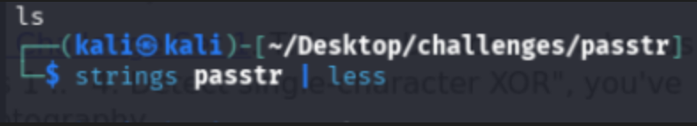
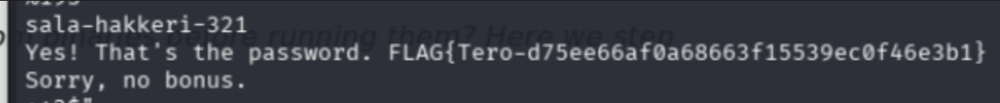
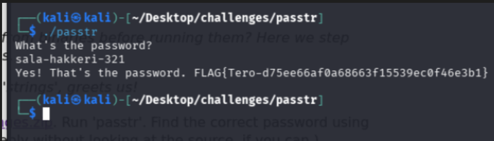
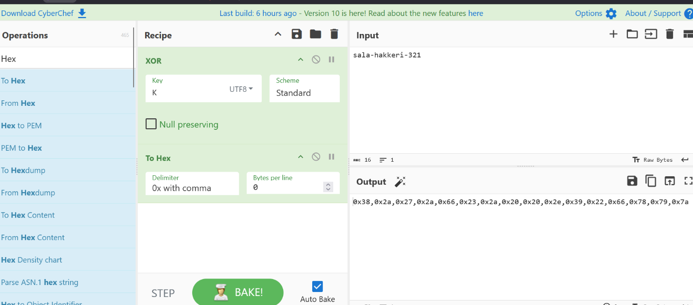
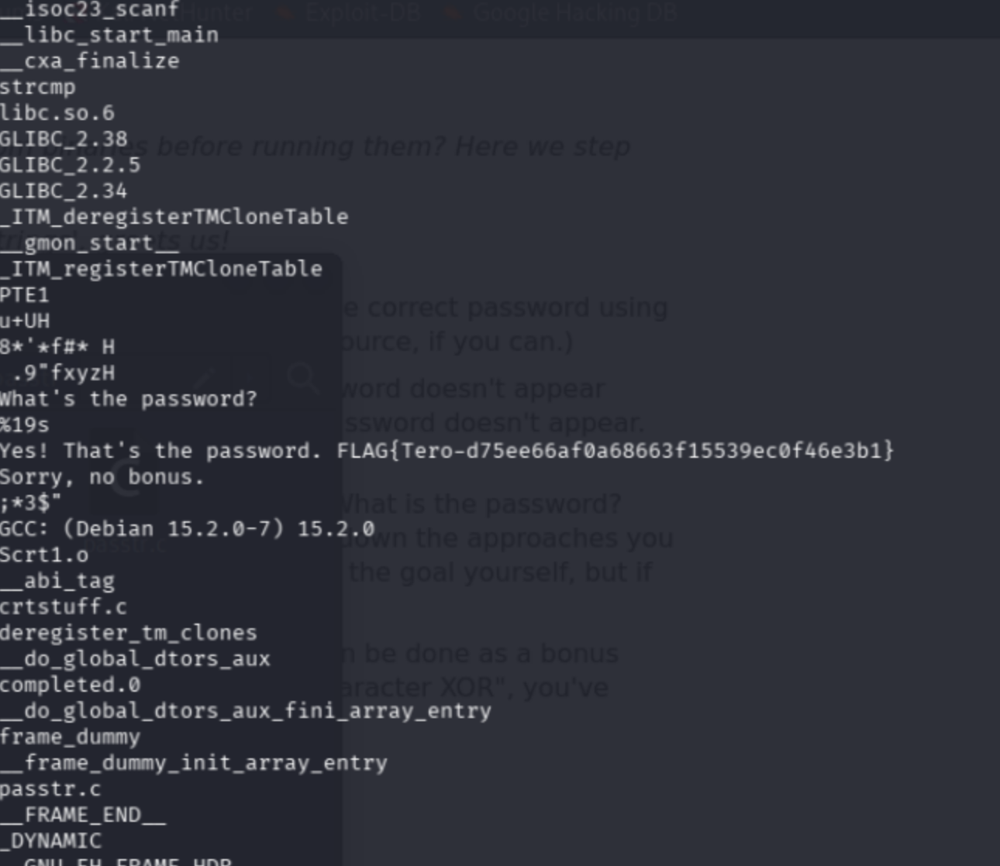
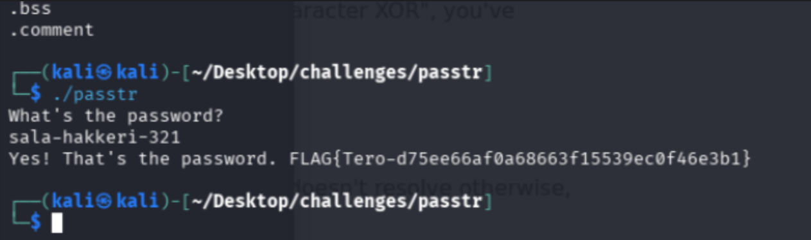
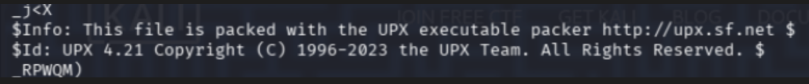
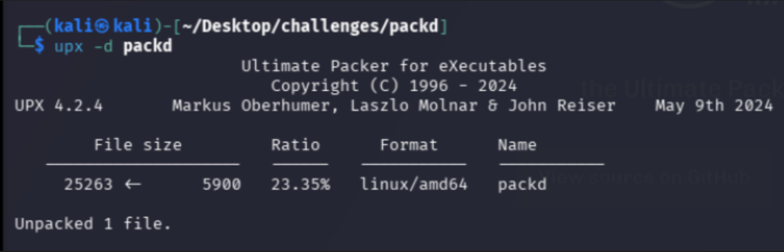
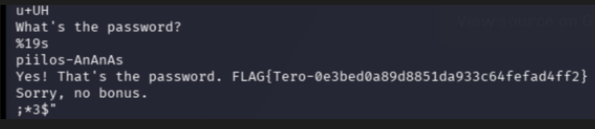

## a) passtr

I start by downloading and unzip the [ezbin-challenges.zip](https://terokarvinen.com/loota/yctjx7/ezbin-challenges.zip) from the terokarvinen.com website.

Before running the application (in case it's malicious) i prefere to check the content of the file beforehand. for a quick check i used the "strings" command. It will display the readable content from the binary : 



A flag can be found within the challenge file. 



It seems that it also revealed the password that is required for the challenge. let's test it out even if we already know the result of a correct password : 



It was indeed the correct password. 

## b) Fix passtr

Let's try to correct the issue in the code : 

``` c
// passtr - a simple static analysis warm up exercise
// Copyright 2024 Tero Karvinen https://TeroKarvinen.com

#include <stdio.h>
#include <string.h>

int main() {
	char password[20];
	
	printf("What's the password?\n");
	scanf("%19s", password);
	if (0 == strcmp(password, "sala-hakkeri-321")) {
		printf("Yes! That's the password. FLAG{Tero-d75ee66af0a68663f15539ec0f46e3b1}\n");
	} else {
		printf("Sorry, no bonus.\n");
	}
	return 0;
}
```

The problem with the current code is that the strings will appear in the binary and can be read with `strings` command. 

To solve this issue, we'll use something i've seen during a CTF game. We'll Cipher the string with a XOR method ([wikipedia link to the XOR cipher logic](https://en.wikipedia.org/wiki/XOR_cipher))

For this methode we need a key and a to adapt the secret with the key. For this exercice i will use "K" as a Key.

then we will have to scramble the password to have the secret XORed with the Key. Since it's a unique time, i'll do it with a cipher online, and i won't write a script for that. I've used [CyberChef](https://gchq.github.io/CyberChef/):



the cipher output is : 
0x38,0x2a,0x27,0x2a,0x66,0x23,0x2a,0x20,0x20,0x2e,0x39,0x22,0x66,0x78,0x79,0x7a

Now we put that in the code : 

``` c
#include <stdio.h>
#include <string.h>

int main() {
    char password[20];
    char key = 'K'; // <--- We add the Key as a variable here

    char secret[] = {
        0x38, 0x2a, 0x27, 0x2a, 0x66, 0x23, 0x2a, 0x20, 
        0x20, 0x2e, 0x39, 0x22, 0x66, 0x78, 0x79, 0x7a, 0x00
    }; // <--- We add the output and we add the "0x00" to end the chain (null char)

    for(int i = 0; i < 16; i++) {
        secret[i] = secret[i] ^ key;
    } //<--- here we decipher the chain in memory before the compare

    printf("What's the password?\n");
    scanf("%19s", password);

    if (0 == strcmp(password, secret)) {
        printf("Yes! That's the password. FLAG{Tero-d75ee66af0a68663f15539ec0f46e3b1}\n");
    } else {
        printf("Sorry, no bonus.\n");
    }
    
    return 0;
}
```

The secret is now obfuscated with a XOR cypher. Let's try it. 

After using `strings` the password no longer appear : 



Let's try if it still work : 



The password still work. the obfuscation is a sucess. 

## c) Packd

When we `strings` the packd program we see that the flag has been cutted in multiple parts. We'll try to fix that to retrieve the flag. 

We can see that there's something that says that this  as been packed by UPX : 



after a quick look on [UPX](![[Pasted image 20260131205912.png]]), I've seen that we can decompress the program with upx -d "FILE".
so i tried : 



Then i checked the binary again and found the flag : 




REPORT MADE BY LUCAS MARTINS